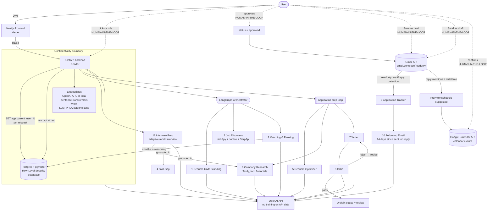

# CareerPilot AI

**An autonomous multi-agent career navigation system.** CareerPilot understands
your resume, discovers roles across job boards, explains *why* each is a fit,
drafts tailored applications through a self-correcting writer/critic loop, and
keeps you in control of every outbound action — all as a single continuous,
agentic workflow.

Built for the Agentic AI Bootcamp final project. Multi-user, deployed live, with
**resume confidentiality treated as a first-class architectural requirement**.

**Live app:** https://careerpilot-ai-swart.vercel.app
**Repo:** https://github.com/kinza500/careerpilot-ai
**Demo video:** https://drive.google.com/drive/folders/16ur740yKyLwP_JvPyz_tw7yYBAQRmngd?usp=drive_link

---

## Why it's agentic (not a chatbot)

- **Specialised, tool-using agents** coordinated by a LangGraph state machine.
- **Explainable reasoning** — every ranked role comes with a human-readable why.
- **Self-correcting loop** — a Critic Agent reviews the Writer's drafts and sends
  them back for revision until they pass.
- **Human-in-the-loop** — nothing is sent, drafted into Gmail, or added to your
  calendar without an explicit click; CareerPilot only ever detects what you
  did yourself (via `gmail.readonly`), never assumes it.
- **Closes the loop** — tracks real send/reply status from Gmail, nudges a
  follow-up 14 days after no response, and turns a reply's date/time into a
  calendar-event suggestion for you to confirm.
- **Memory** — liked/rejected/applied signals are captured to personalise future
  runs (extension point wired).

---

## Architecture



The **confidentiality boundary** is the point of the design: candidate data is
isolated per user by database RLS, encrypted at rest, and processed only by a
model that doesn't train on it. Embeddings use that same no-training API by
default (resume/job text already goes there for the LLM agents); a fully
local/air-gapped mode (`LLM_PROVIDER=ollama`) keeps embeddings on-box too. See
[`docs/SECURITY.md`](docs/SECURITY.md).

---

## Tech stack

| Layer | Technology |
|---|---|
| Orchestration | LangGraph, LangChain |
| LLM | OpenAI API (default) — or Anthropic / Ollama for local/air-gapped |
| Embeddings | OpenAI API (default) — or local sentence-transformers when `LLM_PROVIDER=ollama` |
| Backend | Python 3.11, FastAPI, SQLAlchemy async, Pydantic v2, Celery |
| Data | Postgres 16 + pgvector, **Row-Level Security** |
| Documents | PyMuPDF, python-docx, WeasyPrint |
| Job discovery | JobSpy (LinkedIn/Indeed/Glassdoor/Google/Bayt), Jooble API, SerpApi (Google Jobs) — round-robin merged, per-country ambiguous-city exclusions |
| Company research | Tavily (search API for agents) — culture/hiring + financial/revenue, with real source links |
| Email & Calendar | Gmail API (compose/readonly) — draft, sent-detection, reply-detection; Google Calendar API (calendar.events) — human-confirmed interview scheduling |
| Frontend | Next.js 14, TypeScript, Tailwind |
| Deploy | Docker Compose (local) · Vercel + Render + Supabase (live) |
| CI | GitHub Actions |

---

## Agent status

| # | Agent | Status |
|---|---|---|
| 1 | Resume Understanding | ✅ real (LLM + PyMuPDF/docx) |
| 2 | Job Discovery & Aggregation | ✅ real (JobSpy + Jooble + SerpApi/Google Jobs, round-robin merged) |
| 3 | Matching & Ranking | ✅ real (pgvector cosine + LLM reasoning) |
| 5 | Resume Optimisation | ✅ real |
| 6 | Company Research | ✅ real (Tavily search → LLM brief, incl. financial/revenue signals, with real source links) |
| 7 | Writer | ✅ real |
| 8 | Critic (feedback loop) | ✅ real |
| 9 | Application Tracker | ✅ real (Gmail-detected send/reply status, consolidated status filter, MIS report) |
| 10 | Follow-up Email | ✅ real (14-day-since-actually-sent nudge, Gmail-threaded draft, human-gated) |
| 11 | Interview Prep | ✅ real (adaptive multi-turn mock interview, capped questions, full history) |
| 4 | Skill-Gap Analysis | 🟡 stub w/ interface (naive keyword gap; feeds Interview Prep's grounding) |
| — | Memory & Personalisation | 🟡 schema + event capture wired |

Stubs have real, typed interfaces and minimal working logic in
`backend/app/agents/stubs.py`, marked with `TODO` for where to deepen.
Agents 10 and 11 have grown beyond `stubs.py` into their own modules
(`app/routers/applications.py`'s follow-up endpoints, `app/agents/interview_agent.py`)
now that they're fully real.

---

## Agent prompt design

All system prompts live in one auditable file:
[`backend/app/agents/prompts.py`](backend/app/agents/prompts.py). Design
principles applied to every agent:

1. **Single responsibility** — one narrow job per prompt.
2. **Explicit output contract** — each prompt states the exact JSON keys
   expected; the LLM layer parses and validates.
3. **Truthfulness guardrails** — optimiser/writer are told never to invent
   skills, employers, or achievements the candidate doesn't have.
4. **Calibrated scoring** — the matching prompt is told to use 0.5 for unknowns
   rather than guessing high, and to be honest about gaps.
5. **Separation of judging and doing** — the Critic *judges and instructs*; it
   never rewrites, which keeps the feedback loop clean.

---

## Quickstart (local)

```bash
cp backend/.env.example backend/.env
python -c "from cryptography.fernet import Fernet; print('CV_ENCRYPTION_KEY=' + Fernet.generate_key().decode())"   # paste into .env
# set JWT_SECRET and OPENAI_API_KEY in .env too
docker compose up --build
```

Open http://localhost:3000 · API docs at http://localhost:8000/docs.

Full instructions incl. the managed live deploy:
[`docs/DEPLOYMENT.md`](docs/DEPLOYMENT.md).

---

## Repo layout

```
backend/
  app/
    agents/       # LLM, embeddings, prompts, discovery/matching/interview
                  #   agents, gmail_agent.py (Gmail + Calendar API), stubs.py
    core/         # crypto (CV encryption), security (JWT)
    routers/      # auth, resumes, jobs, applications, interview
    db.py         # per-request RLS-scoped sessions
    models.py     # ORM
    main.py       # FastAPI app
  sql/001_init.sql  # schema + pgvector + RLS policies
  tests/
frontend/         # Next.js 14 app
docs/             # SECURITY.md, DEPLOYMENT.md
docker-compose.yml
render.yaml
```

---

## Tests

```bash
cd backend && pip install -r requirements.txt && pytest -q
```

Covers CV encryption round-trip, fail-closed behaviour when the key is missing,
and the ranking math — the pieces most important to get right.

---

## License

MIT — see [`LICENSE`](LICENSE).
